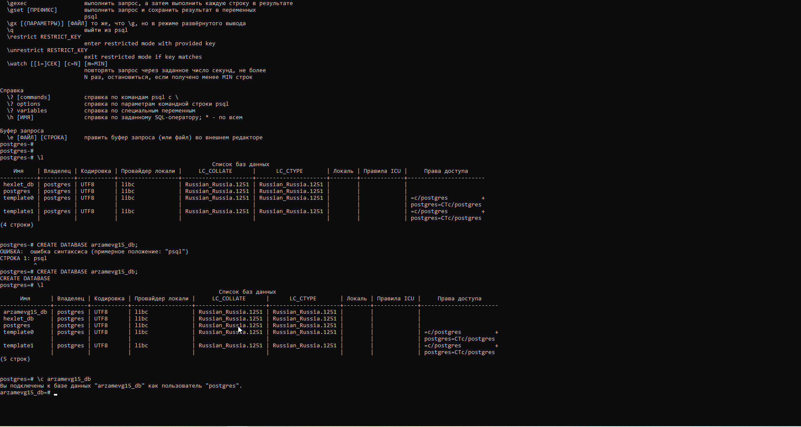

# PostgreSQL-project
Учебный проект по изучению SQL и работе с базой данных PostgreSQL создан в процессе прохождения видеоуроков на YouTube (с субтитрами):

🎥 PostgreSQL с нуля — Полный курс (Урок 1)
🎥 Изучаем SQL с нуля: простой план для новичков | Советы программистам | Хекслет.

💻 Описание проекта: В ходе проекта создается база данных, таблица студентов были изучены и применены основные SQL-команды, обеспечивающие полный цикл работы с данными: CREATE⮕READ⮕UPDATE⮕DELETE (CRUD)

✏️ Этапы работы:

🔹Установка и подготовка среды
- Установлен сервер PostgreSQL версии 17.6.
- Настроено подключение через SQL Shell (psql) и pgAdmin 4.
- Проверено соединение с локальным сервером (localhost, порт 5432).
  
🔹Подключение к серверу PostgreSQL
- Выполнено подключение к базе postgres под пользователем postgres.
- Проверена корректность кодировки и локали (Russian_Russia.1251).
- Изучены базовые команды psql: ?, \l, \c, \q.

🔹Создание и настройка базы данных PostgreSQL arzamevg15_db
- Была создана новая БД для хранения информации о студентах с помощью команды: CREATE DATABASE arzamevg_db;
- Для работы с созданной базой использовалась команда: \с arzamevg_db
- В базе данных создана таблица students, содержащая информацию о студентах: CREATE TABLE students(std_id INT PRIMARY KEY, std_name VARCHAR(240) NOT NULL, std_program VARCHAR(240) NOT NULL, std_stream VARCHAR(120) NOT NULL);
- В таблицу добавлены (CREATE) несколько записей с помощью команды: INSERT
- Для чтения данных (READ) таблицы использовалась команда: SELECT * FROM srudents;
- Для изменения данных (UPDATE) в таблице применялась команда: UPDATE students SET std_stream='RUS' WHERE std_id=3;
- Для удаления записи (DELETE) из таблицы использовалась команда: DELETE FROM students WHERE std_id=2;

🖼️ Скриншот проекта

